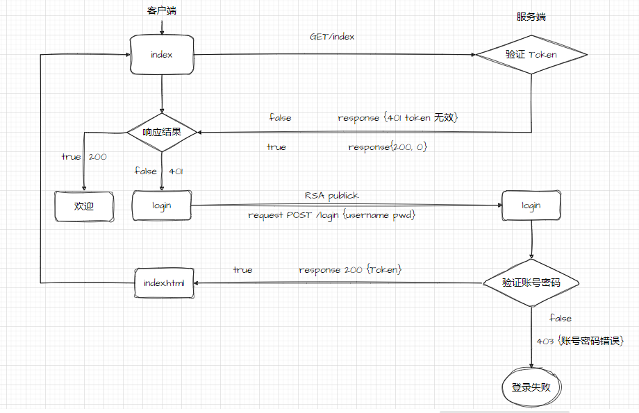

# express 注册登录案例

实现 前后端分离 的注册登录案例, 实现
RSA 加密
jwt-Token 验证
前后端数据校验

## server 服务端

### 接口

    登录 login POST
    注册 register POST
    公钥获取 getPublicKey GET

### 模块

    User 管理模块['添加', '查询', '验证']
    Key 管理模块['生成秘钥', '获取公钥', '加密', '解密']
    jsonwebtoken['创建 Token']
    validate 内容校验模块['账号格式', '密码格式', '长度', '必填', '返回语']
    statusCode 管理 自定义状态码 ['账号或密码错误', 'Token 错误', 'Token 失效',
    '账号已存在', '账号密码格式不正确', '登录成功', '注册成功']

### 中间件

    CORS 跨域 携带 Cookie
    express-JWT 验证 Token

## client 客户端

## UI

    layerUI

## 库

    JQuery
    axios
    jsencrypt

## 页面

    login.html
    index.html

## 业务流程

    index => get/index => 验证 Token

